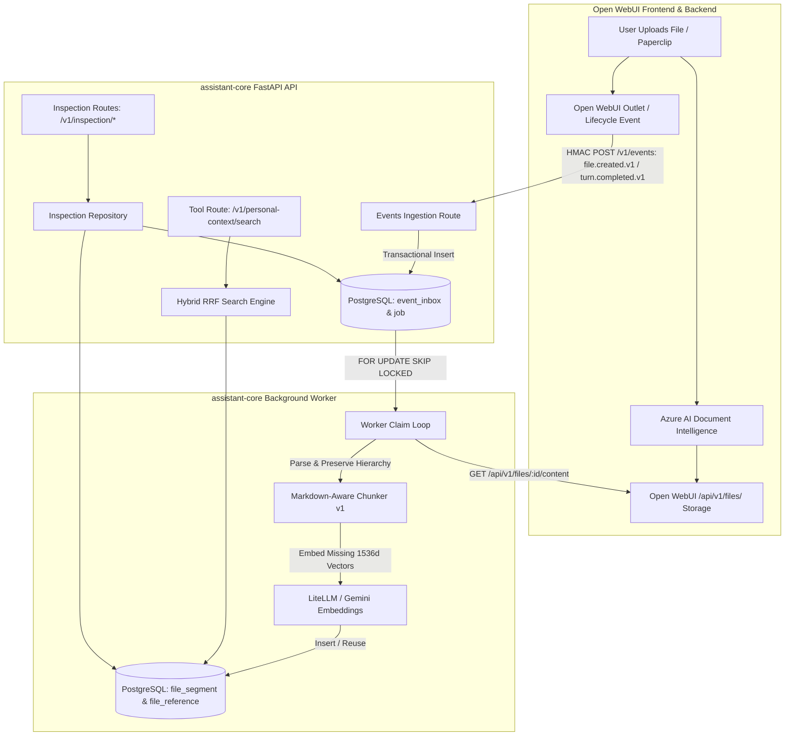
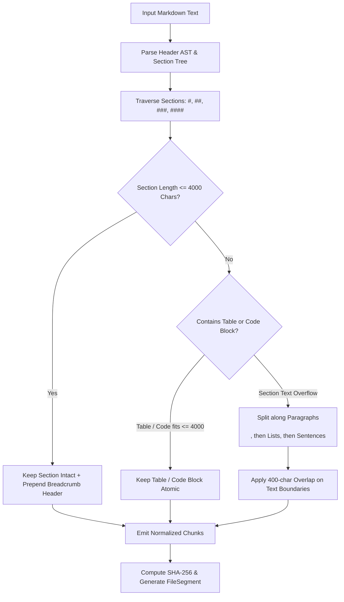

# Open WebUI File Awareness, Markdown Chunking, and Observability Design

**Date:** 2026-08-16  
**Status:** Proposed / Under Review  
**Target Milestone:** Option 2 — Decoupled File & Document Awareness (Content Catalog)

---

## 1. Purpose & Executive Summary

This specification defines the architecture for **File & Document Awareness** within `assistant-core` and the Open WebUI ecosystem. The objective is to make uploaded files (both in-chat paperclip attachments and Library/Knowledge Base documents) searchable alongside past conversations via hybrid semantic search (`tsvector` + `pgvector`), while maintaining **strict non-blocking performance**, **exact content deduplication**, **markdown-aware chunking**, and **observability-first diagnostic tooling**.

---

## 2. Core Principles & Constraints

1. **Non-Blocking & Deadlock-Free**: File content fetching, chunking, and embedding occur strictly asynchronously in the background worker. The Open WebUI chat `inlet()` and `outlet()` request paths remain lightning-fast and never execute synchronous self-HTTP requests.
2. **Observability-First**: Every stage of document discovery, content retrieval, chunking, embedding, and storage is instrumented with structured JSON logs, dedicated read-only inspection endpoints, in-chat diagnostic tools, and Prometheus metrics. No failure is silent or invisible.
3. **Metadata-Safe Privacy**: Logs, metrics, and inspection endpoints contain only stable IDs, filenames, mime types, byte counts, chunk counts, error codes, and latencies. No raw document text, prompts, passwords, or HMAC secrets are ever logged or exposed in diagnostics.
4. **Markdown-Aware Chunking (`markdown-v1`)**: Leverages Azure Document Intelligence's structured Markdown output to preserve header hierarchies, breadcrumbs, atomic Markdown tables, and fenced code blocks.
5. **Exact Per-User Deduplication**: Content segments are keyed by `(user_id, content_sha256, chunking_version)`. Identical files or identical sections across files share storage and embeddings.
6. **Fail-Open Resilience**: If embedding endpoints are slow or unavailable, document segments remain immediately searchable via PostgreSQL full-text search (lexical mode) without breaking chat.
7. **Clean Lifecycle & Fast Tombstoning**: When a file is removed in Open WebUI, a signed `file.deleted.v1` event instantly marks `FileReference.tombstoned_at = now()`, immediately excluding it from search and recent listings.

---

## 3. End-to-End Architecture & Data Flow



### Ingestion Lifecycle Stages:
1. **Event Trigger**: When a file is uploaded or used in a turn, Open WebUI sends an HMAC-signed event (`file.created.v1` or `turn.completed.v1` containing file metadata) to `assistant-core`.
2. **Transactional Enqueue**: `assistant-core` records the event in `assistant_core.event_inbox` and enqueues `Job(kind="index_file", payload={"file_id": ..., "user_id": ..., "filename": ...})`.
3. **Worker Processing**:
   - Worker claims the job with `FOR UPDATE SKIP LOCKED`.
   - Fetches extracted Markdown from Open WebUI's file content API using the configured Open WebUI service API key.
   - Chunks the document using `markdown-v1` chunking.
   - Persists lexical segments and references.
   - Computes 1536-dimensional embeddings for newly created segments via the configured embedder.
   - Marks the job completed, logging timing, chunk counts, and byte sizes.

---

## 4. Database Schema & Persistence

Alembic migration revision: `0006_file_awareness` (down revision: `0005_conversation_recall`).

### 4.1 `assistant_core.file_segment`
Stores canonical, deduplicated Markdown text segments and their embeddings:

| Column | Type | Constraints / Details |
| :--- | :--- | :--- |
| `id` | `UUID` | Primary Key, `default=uuid7/uuid4` |
| `user_id` | `UUID` | Foreign Key (`user_identity.id`), Indexed |
| `content_sha256` | `VARCHAR(64)` | SHA-256 of normalized segment content |
| `chunking_version` | `VARCHAR(40)` | Fixed `"markdown-v1"` |
| `content` | `TEXT` | Extracted Markdown passage (Max 4,000 chars) |
| `search_vector` | `TSVECTOR` | Generated column: `to_tsvector('simple', content)`, GIN Indexed |
| `embedding` | `Vector(1536)` | Cosine HNSW Indexed (`vector_cosine_ops`) |
| `embedding_model` | `VARCHAR(200)` | e.g. `models/text-embedding-004` |
| `embedding_dimension`| `INTEGER` | Default `1536` |
| `embedding_version`| `VARCHAR(80)` | e.g. `v1` |
| `embedded_at` | `TIMESTAMPTZ` | Timestamp when embedding was stored |
| `created_at` | `TIMESTAMPTZ` | Server default `now()` |

*Unique Constraint:* `(user_id, content_sha256, chunking_version)` ensures identical text is stored and embedded only once per user.

### 4.2 `assistant_core.file_reference`
Links native Open WebUI file identifiers to shared segments:

| Column | Type | Constraints / Details |
| :--- | :--- | :--- |
| `id` | `UUID` | Primary Key |
| `user_id` | `UUID` | Foreign Key (`user_identity.id`), Indexed |
| `segment_id` | `UUID` | Foreign Key (`file_segment.id`), Indexed |
| `native_file_id` | `VARCHAR(200)` | Open WebUI file UUID |
| `filename` | `VARCHAR(500)` | Original filename (e.g. `budget_2026.docx`) |
| `mime_type` | `VARCHAR(100)` | e.g. `application/vnd.openxmlformats...` |
| `header_path` | `VARCHAR(500)` | Markdown breadcrumb path (e.g. `Finance > Q3 Projections`) |
| `chunk_ordinal` | `INTEGER` | 0-indexed position within the file |
| `created_at` | `TIMESTAMPTZ` | Server default `now()` |
| `tombstoned_at` | `TIMESTAMPTZ` | Nullable, set on `file.deleted` |

*Unique Constraint:* `(user_id, native_file_id, chunk_ordinal)`.  
*Filtered Index:* `CREATE INDEX ix_file_reference_active ON file_reference (user_id, native_file_id) WHERE tombstoned_at IS NULL`.

---

## 5. Markdown-Aware Chunking Engine (`markdown-v1`)

The chunker parses structured Markdown produced by Azure Document Intelligence or standard extractors:



### Rules:
1. **Header Breadcrumb Context**: When a section is chunked, the chunk includes its parent breadcrumb (e.g. `### Section Title`) at the top so vector similarity and lexical matching retain domain context.
2. **Table Atomicity**: Markdown tables (`| ... |`) are never sliced midway unless the table itself exceeds 4,000 characters.
3. **Fenced Code Block Atomicity**: Blocks enclosed in ```` ``` ```` are kept intact.
4. **Boundary Fallback**: Subdivision occurs on `\n\n` (paragraphs), then list items (`\n- `, `\n* `, `\n1. `), then sentences.
5. **Length Bounds**: Max 4,000 characters per chunk, with up to 400 characters overlap between subdivided sections.

---

## 6. Comprehensive Observability & Diagnostics Architecture

Observability is built into every layer to make system health completely transparent and effortlessly debuggable.

### 6.1 Structured JSON Logs (Zero Content Leakage)
Every worker stage logs machine-readable JSON:
- `file_indexing_claimed`: `{ file_id, user_id, job_id, attempt }`
- `file_content_fetched`: `{ file_id, byte_size, duration_ms, source: "openwebui_api" }`
- `file_chunked`: `{ file_id, total_chunks, reused_segments, new_segments, duration_ms }`
- `file_embedded`: `{ file_id, embedded_segments, failed_embeddings, duration_ms }`
- `file_indexing_completed`: `{ file_id, total_chunks, duration_ms, status: "success" }`
- `file_indexing_failed`: `{ file_id, stage, error_type, error_code, http_status, attempt, duration_ms }`

### 6.2 Inspection API Endpoints (`/v1/inspection/*`)
Protected by HMAC authentication:

1. **`POST /v1/inspection/files/stats`**:
   ```json
   {
     "total_files": 42,
     "active_files": 40,
     "tombstoned_files": 2,
     "total_segments": 315,
     "embedded_segments": 315,
     "lexical_only_segments": 0,
     "reused_segments_count": 48,
     "queued_jobs": 0,
     "dead_jobs": 0,
     "last_indexed_at": "2026-08-16T14:55:00Z"
   }
   ```
2. **`POST /v1/inspection/files/recent`** (query params: `limit=10`):
   ```json
   {
     "files": [
       {
         "native_file_id": "9b1deb4d-3b7d-4bad-9bdd-2b0d7b3dcb6d",
         "filename": "Q3_Report.docx",
         "mime_type": "application/vnd.openxmlformats-officedocument.wordprocessingml.document",
         "chunk_count": 8,
         "created_at": "2026-08-16T14:50:00Z",
         "tombstoned_at": null,
         "status": "indexed"
       }
     ]
   }
   ```
3. **`POST /v1/inspection/jobs/dead`**:
   ```json
   {
     "dead_jobs": [
       {
         "job_id": "...",
         "kind": "index_file",
         "file_id": "...",
         "attempts": 5,
         "last_error": "HTTP 404: File content not found on Open WebUI",
         "failed_at": "2026-08-16T14:45:00Z"
       }
     ]
   }
   ```

### 6.3 Open WebUI In-Chat Diagnostic Tools
Extended in [`assistant_core_tool.py`](file:///home/aman/projects/openwebui_config/adapters/openwebui/assistant_core_tool.py):
- `show_file_index_status()`: Summarizes total files, segments, embedding coverage, and queued/dead jobs.
- `show_failed_indexing_jobs()`: Lists failed file indexing jobs with reasons.
- `show_recent_files(limit)`: Displays recently indexed files and chunk counts.

### 6.4 Prometheus Metrics
- `assistant_core_file_indexing_total{status="success|failure|retry"}`
- `assistant_core_file_indexing_duration_seconds` (Histogram)
- `assistant_core_file_chunks_total`
- `assistant_core_dead_jobs_count`

---

## 7. Unified Hybrid Search & Tool Surface

When `search_personal_context(query)` is executed:
1. **Query Processing**: Query text is converted to a `tsquery` (FTS) and embedded into a 1536-d vector.
2. **Dual Candidate Retrieval**:
   - Top $K$ conversation segments retrieved (lexical + semantic).
   - Top $K$ file segments retrieved (lexical + semantic).
3. **Reciprocal Rank Fusion (RRF)**: Merges conversation and document hits into a unified ranked list.
4. **Output Rendering**:
   ```text
   [1] [Document: Q3_Report.docx > Financials] (relevance: 0.94)
   "Quarterly revenue increased by 14% across cloud services..."
   Source ID: file-ref-uuid-1234

   [2] [Conversation: Backend Discussion, 2026-08-12] (relevance: 0.89)
   "We agreed to use asyncpg with NullPool..."
   Source ID: conv-ref-uuid-5678
   ```
5. **Bounded Read (`read_personal_context`)**: Passing `file-ref-uuid-1234` returns the exact passage along with adjacent file chunks (`chunk_ordinal - 1` and `chunk_ordinal + 1`) and file provenance.

---

## 8. Error Handling, Retries & Dead Letter Policy

- **Network / API Failures**: If Open WebUI API or LiteLLM is temporarily unreachable, the job is retried with exponential backoff (`max_attempts = 5`).
- **Dead Letter State**: If 5 attempts fail, the job is marked `status="dead"` with `last_error` and `failed_at` stored in PostgreSQL.
- **Fail-Open Search**: If embedding fails during a search query, hybrid search seamlessly falls back to PostgreSQL Full-Text Search and reports `mode="lexical"` without throwing errors or interrupting user chat.

---

## 9. Verification & Test Plan

1. **Unit Tests**:
   - `test_markdown_chunker.py`: Verifies header breadcrumbs, table atomicity, fenced code blocks, overlap, and length constraints.
   - `test_file_repository.py`: Verifies segment deduplication, reference creation, tombstoning, and FTS/vector indexing.
   - `test_file_indexing_worker.py`: Verifies worker job claiming, retry handling, and dead-job recording.
   - `test_inspection_api.py`: Verifies `/v1/inspection/files/*` routes, stats accuracy, and content-free security.
2. **Adapter Tests**:
   - `test_assistant_core_tool.py`: Verifies `show_file_index_status`, `show_recent_files`, and fail-open rendering.
3. **End-to-End Smoke Test**:
   - Upload sample DOCX/Markdown in Open WebUI.
   - Confirm worker ingests file, logs structured events, and creates segments.
   - Run `search_personal_context` to verify file hit relevance.
   - Delete file in Open WebUI and verify immediate tombstoning.
