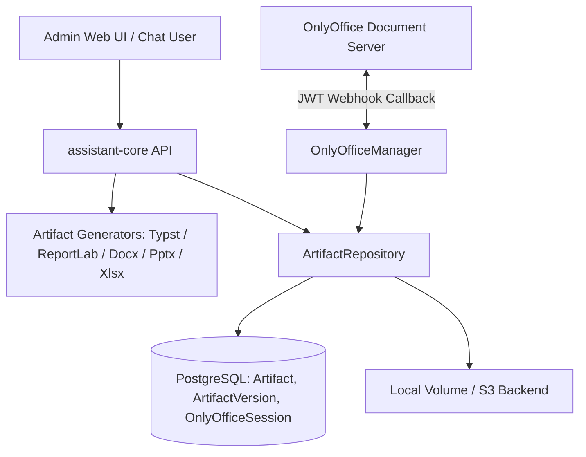

# Advanced Artifact Lifecycle, Typst Engine, and Hardened OnlyOffice Design

Date: 2026-08-22  
Status: Approved 2026-08-22  
Phase: Phase 6 — Advanced Artifact Lifecycle  

---

## 1. Overview & Goals

This specification defines the Phase 6 enhancements for the `assistant-core` artifact subsystem and Open WebUI companion integrations:

1. **Typst Generation Engine**: Fast, publication-grade typesetting for resumes, formal whitepapers, and reports using the official `typst` Python package (`typst.compile()`).
2. **Hardened OnlyOffice Document Server Integration**: Strict JWT signature verification on webhooks, comprehensive callback status lifecycle handling (`status=1, 2, 3, 4, 6`), and atomic, non-destructive versioning ($v_N \rightarrow v_{N+1}$).
3. **Artifact Version History, Diffing & Revert**:
   - Explicit version querying and historical downloading.
   - Text/structural diff calculation between version $A$ and version $B$.
   - One-click rollback restoring version $K$ as a new immutable revision $N+1$.
4. **Admin UI Management**: Interactive Version History drawer, unified diff viewer, and quick-action controls in the Web UI dashboard (`/ui`).
5. **Open WebUI Adapter Tools**: Adding `create_typst_document` and `create_resume` to `assistant_core_artifacts_tool.py`.

---

## 2. Architecture & Component Design

---

## 3. Detailed Subsystem Specifications

### 3.1 Typst Generation Engine (`TypstGenerator`)

- **Module**: `assistant-core/src/assistant_core/artifacts/generators/typst_gen.py`
- **Dependencies**: `typst>=0.15.0`
- **Capabilities**:
  - `compile_markup(markup: str) -> bytes`: Compiles raw Typst markup into high-fidelity PDF bytes.
  - `generate_resume(spec: ResumeSpec) -> bytes`: Generates a modern two-column / single-column professional software engineering resume with:
    - Contact banner, GitHub, LinkedIn, location.
    - Summary statement.
    - Experience timeline with bullet points and technologies used.
    - Education, degrees, and dates.
    - Skills grouping (Languages, Frameworks, Infrastructure, Tools).
    - Projects portfolio with links and highlights.
  - `generate_report(spec: DocumentSpec) -> bytes`: Renders standard `DocumentSpec` structures into Typst markup for publication-quality output.
- **Repository Integration**:
  - `ArtifactRepository._render_binary` supports `artifact_type="typst"` (raw Typst markup / PDF output) and `resume_spec`.

### 3.2 Hardened OnlyOffice Integration (`OnlyOfficeManager`)

- **Module**: `assistant-core/src/assistant_core/artifacts/onlyoffice.py`
- **JWT Verification**:
  - Document Server sends signed JWT tokens in `Authorization: Bearer <jwt>` or payload `{"token": "..."}`.
  - When `settings.onlyoffice_jwt_secret` is configured, decode and verify the token. Reject unauthorized webhooks with `401 Unauthorized`.
- **Callback Status Handling**:
  - `status=1` (Being Edited): Update session status to `editing`.
  - `status=2` (Ready for Saving) & `status=6` (Force Save):
    - Download edited file from `payload.url`.
    - Validate downloaded bytes (non-empty, valid hash).
    - Create version $N+1$ via `ArtifactRepository.add_raw_binary_version`.
    - Mark session `saved`.
  - `status=3` (Saving Error): Log warning, mark session `error`, leave existing version intact (non-destructive).
  - `status=4` (Closed without changes): Mark session `closed`.
  - Return `{"error": 0}`.

### 3.3 Version History, Diffing & Revert Engine

- **API Routes**:
  - `GET /v1/artifacts/{id}/versions`: Returns list of all versions with version number, size, created date, change summary, and download link.
  - `GET /v1/artifacts/{id}/versions/{version_num}/download`: Downloads a specific version binary.
  - `GET /v1/admin/artifacts/{id}/diff?v1={A}&v2={B}`:
    - Extracts text lines from version $A$ and version $B$.
    - Returns `{ "v1": A, "v2": B, "diff_lines": [...], "additions": X, "deletions": Y }`.
  - `POST /v1/admin/artifacts/{id}/revert`:
    - Payload: `{ "target_version_num": K }`.
    - Clones version $K$ binary data into new version $N+1$ with `change_summary="Reverted to v{K}"`.

### 3.4 Web UI Enhancements (`/ui`)

- **Files**: `index.html`, `app.js`, `styles.css`.
- **Artifacts Tab**:
  - Displays artifact cards with format icon, version pill `vN`, size, and timestamp.
  - "Versions" button opening the Version History modal/drawer.
- **Version History Modal**:
  - List of historical versions ($v_1 \dots v_N$) with change summaries.
  - Per-version buttons: **Download**, **Diff against vCurrent**, and **Revert**.
- **Diff Viewer**:
  - Side-by-side or unified text diff modal showing exact additions (green) and deletions (red).

### 3.5 Open WebUI Adapter Tool Updates

- **File**: `adapters/openwebui/assistant_core_artifacts_tool.py`
- **New Tool Methods**:
  - `create_typst_document(title, markup, ...)`: Generates PDF from raw Typst markup.
  - `create_resume(title, resume_json, ...)`: Generates a publication-grade PDF resume from structured JSON.

---

## 4. Verification Plan

1. **Automated Unit Tests**:
   - `test_typst_generator_compiles_markup`: Tests raw Typst compilation.
   - `test_typst_generator_resume_spec`: Tests structured resume generation.
   - `test_onlyoffice_jwt_verification`: Tests JWT decoding and validation on webhook.
   - `test_onlyoffice_callback_statuses`: Tests `status=1, 2, 3, 4, 6` handling.
   - `test_artifact_version_diff_and_revert`: Tests diff generation and version rollback.
   - `test_artifacts_adapter_tools`: Tests `create_typst_document` and `create_resume`.
2. **Type Checking & Linting**:
   - `uv run ruff check .`
   - `uv run mypy`
   - `uv run pytest` across both `assistant-core` and `adapters/openwebui`.
